# Первая лаба
## Вход в систему и смена пароля.
**ВАЖНО** Для входа и дальнейшей работы я использовал `ssh`

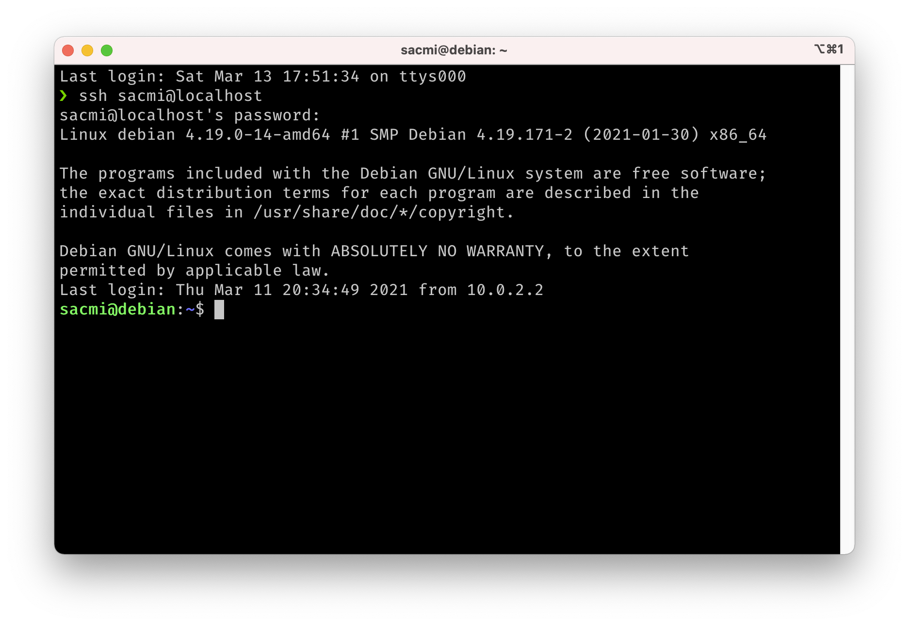

## Домашняя директория пользователя и ее определение.
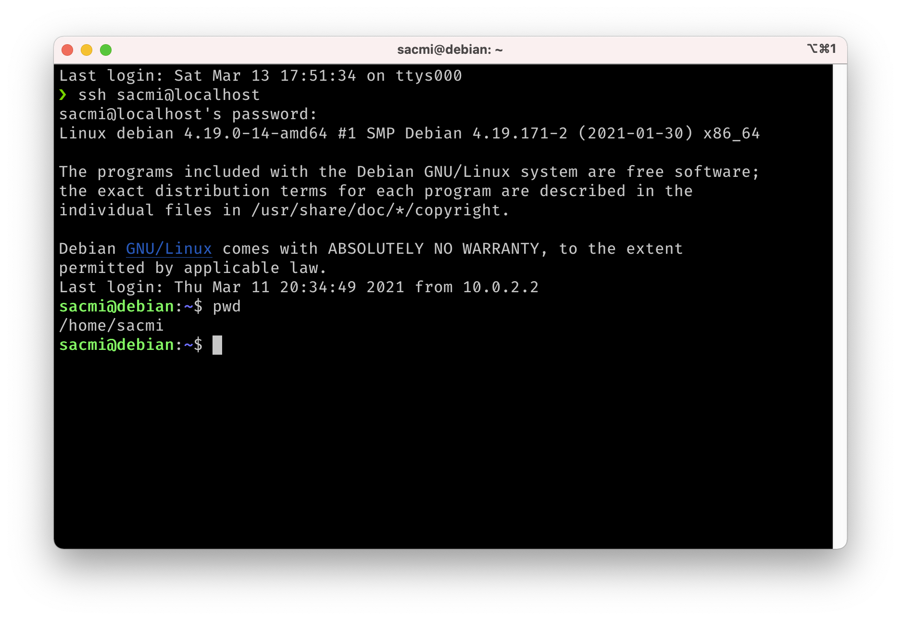

## Команда man - универсальный справочник.
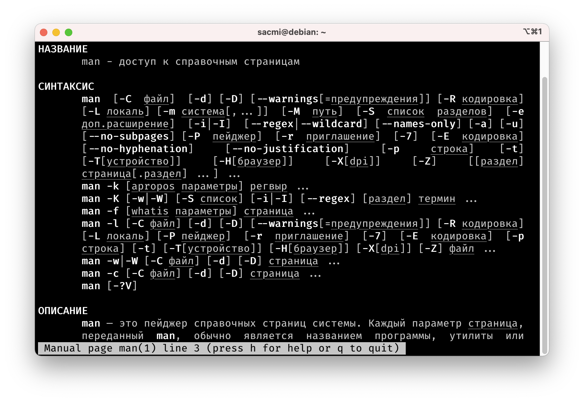

## Путешествие по директорной структуре.
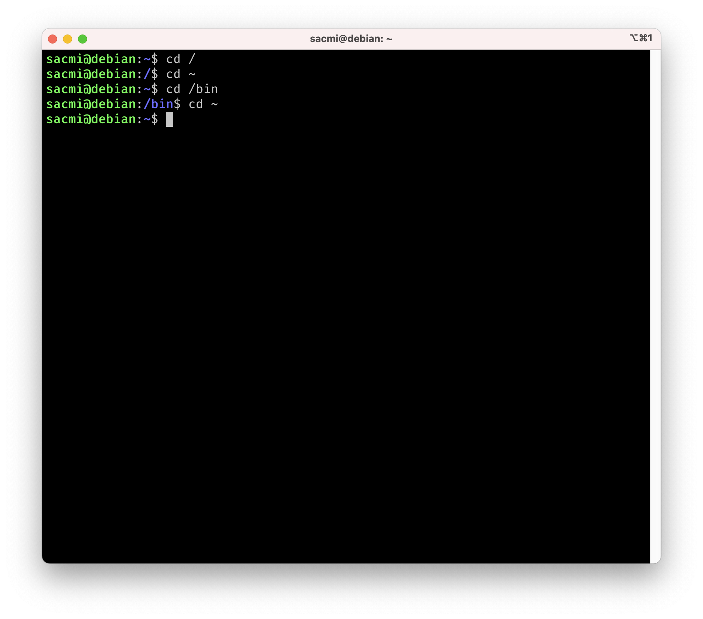

## Создание файла с помощью команды cat.
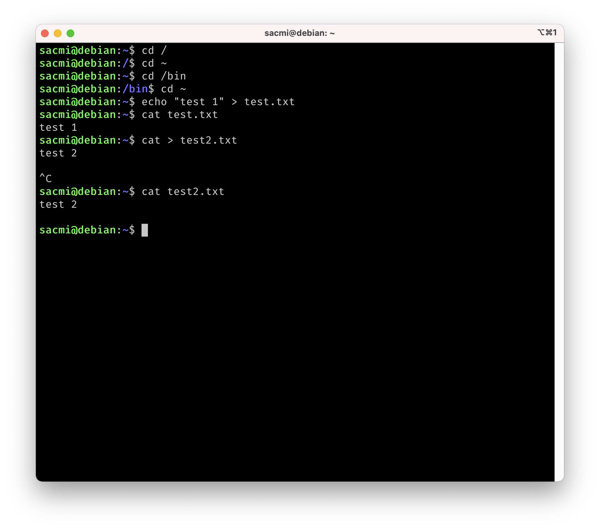

## Система Midnight Commander - mc. Встроенный mc редактор и редактор joe.
### Установка mc


### Запуск mc
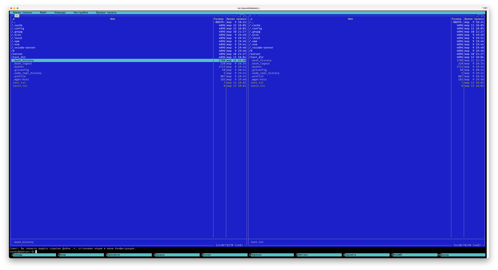

## Команда ls с опциями -al. Использование команд chmod и umask.
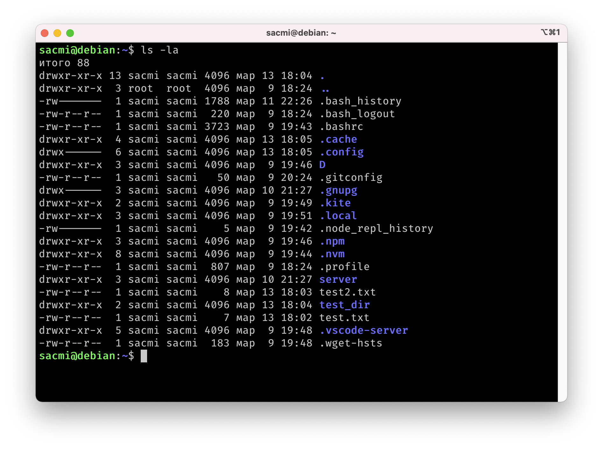

## Написание, компиляция и запуск программы с использованием системных вызовов getuid() и getgid().
```
#include <sys/types.h>
#include <unistd.h>
#include <iostream>

using namespace std;

int main() 
{
  cout << "UID: " << getuid() << endl; 
  cout << "GID: " << getgid() << endl;

  return 0;
}
```


## Написание, компиляция и запуск программы с системными вызовами getpid() и getppid().
```
#include <sys/types.h>
#include <unistd.h>
#include <iostream>

using namespace std;

int main() 
{
  cout << "PID: " << getpid() << endl; 
  cout << "Parent PID: " << getppid() << endl;

  return 0;
}
```


## Прогон программы с использованием вызова fork(), где порожденный процесс делает то же самое, что и родитель.
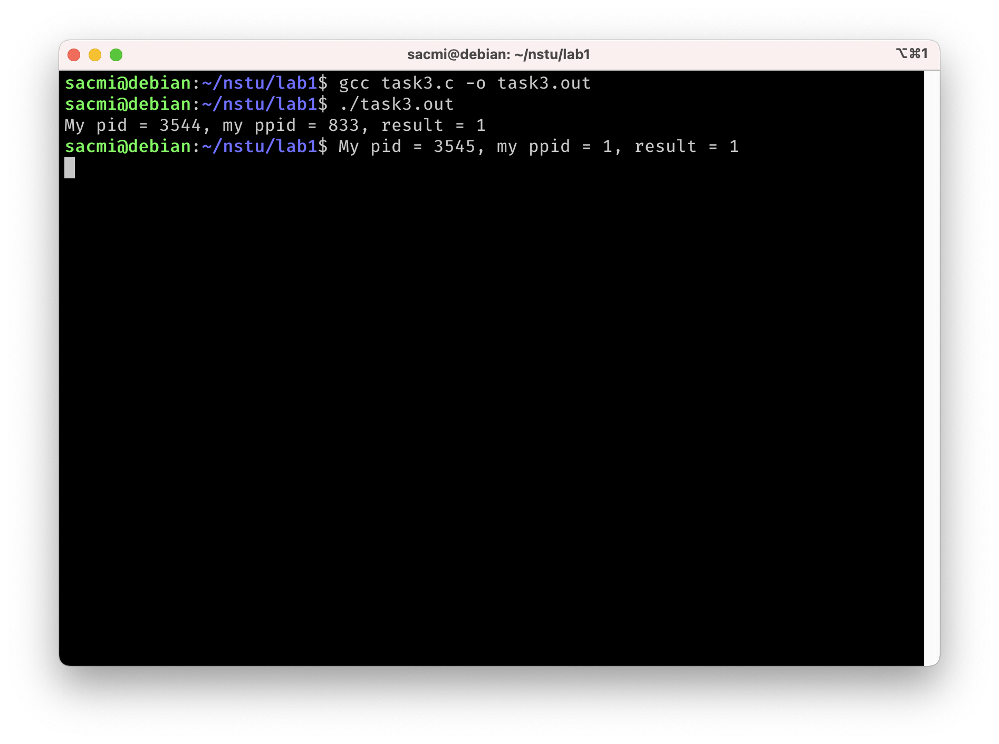

## Написание, компиляция и запуск программы с использованием вызова fork() с разным поведением процессов ребенка и родителя.
```
#include <sys/types.h>
#include <unistd.h>
#include <stdio.h>

int main()
{
  pid_t pid, ppid, chpid;
  int a = 0;

  chpid = fork();

  if (chpid == -1)
  {
    printf("Error!");
    return -1;
  } else if (chpid == 0) {
    printf("I'm a child!\n");
  } else {
    printf("I'm a parent!\n");
  }

  a = a + 1;

  pid = getpid();
  ppid = getppid();

  printf("My pid = %d, my ppid = %d, result = %d\n", (int)pid, (int)ppid, a);

  return 0;
}
```
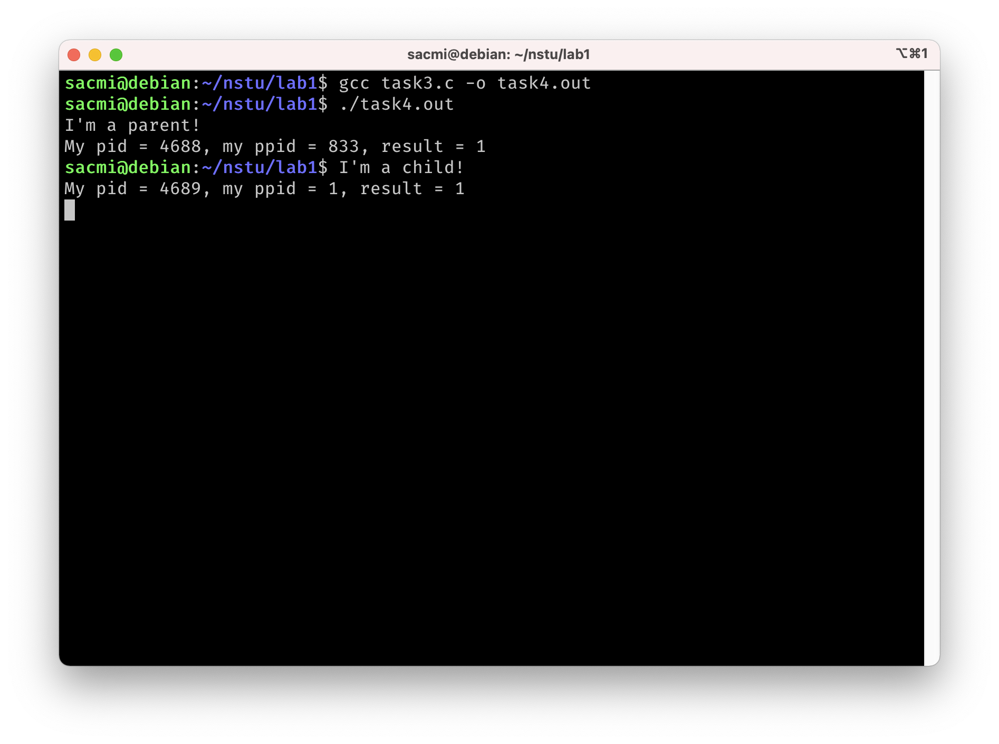

## Написание, компиляция и запуск программы с распечаткой значений переменных среды и аргументов командной строки.
```
#include <stdio.h>

int count_envp_len(char *envp[])
{
  int j = 0;
  for (int i = 0; envp[i] != NULL; i++)
  {
    j = i;
  }

  return j;
}

int main(int argc, char *argv[], char *envp[])
{
  printf("argv elements:\n");
  for (size_t i = 0; i < argc; i++)
  {
    printf("%s \n", argv[i]);
  }

  printf("Length of envp is %d\n", count_envp_len(envp));
  for (size_t i = 0; i < 10; i++)
  {
    printf("%s\n", envp[i]);
  }
  
  return 0;
}
```

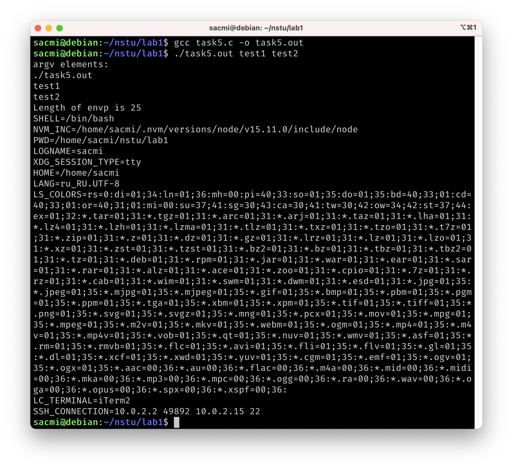

## Прогон программы с использованием системного вызова exec().
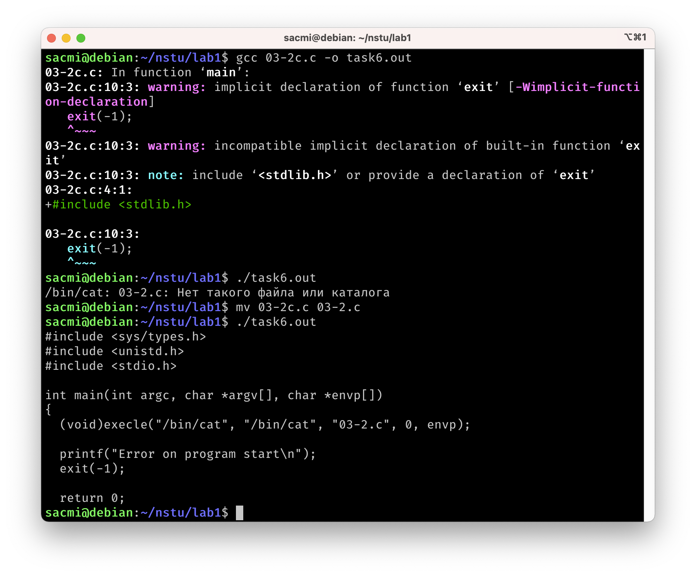

## Написание, компиляция и запуск программы для изменения пользовательского контекста в порожденном процессе.
Тут вызывается `uname -a`

```
#include <sys/types.h>
#include <unistd.h>
#include <stdio.h>

int main(int argc, char *argv[], char *envp[])
{
  (void)execle("/usr/bin/uname", "/usr/bin/uname", "-a", 0, envp);

  printf("Error on program start\n");
  exit(-1);

  return 0;
}
```
